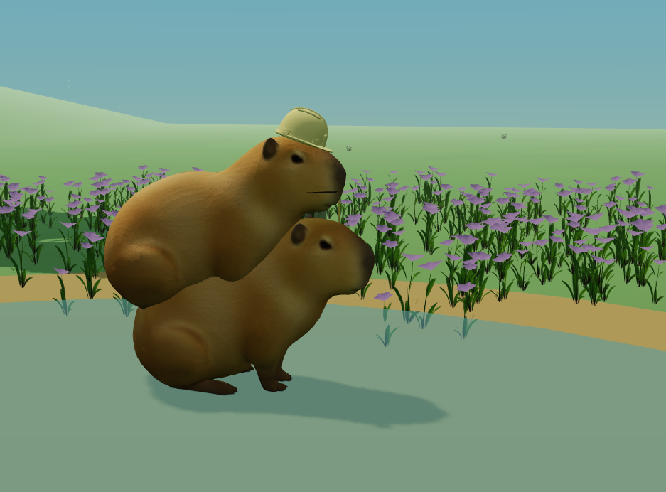
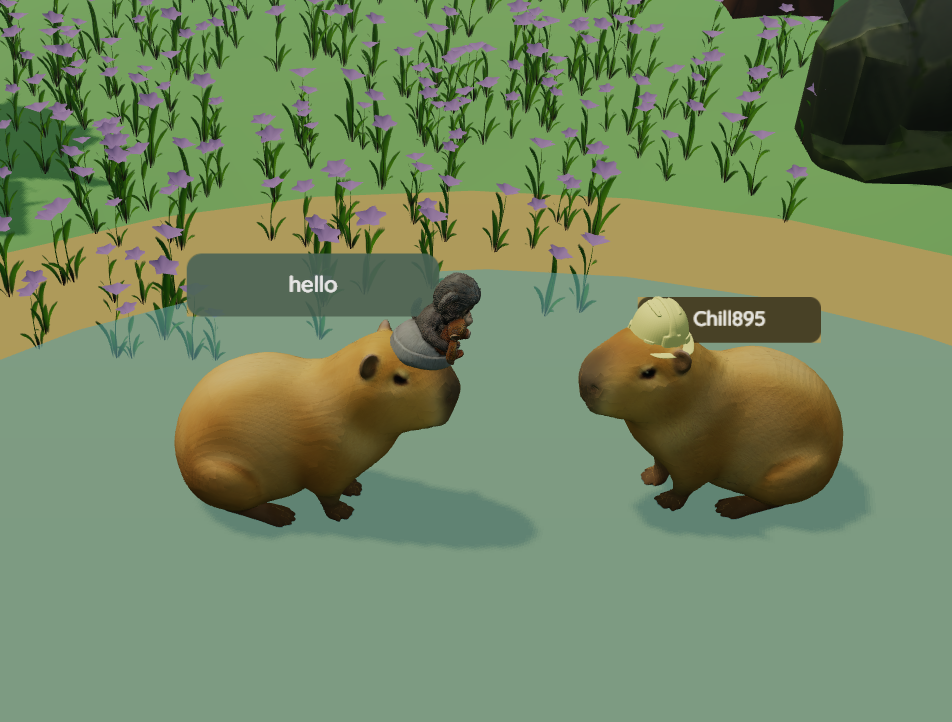
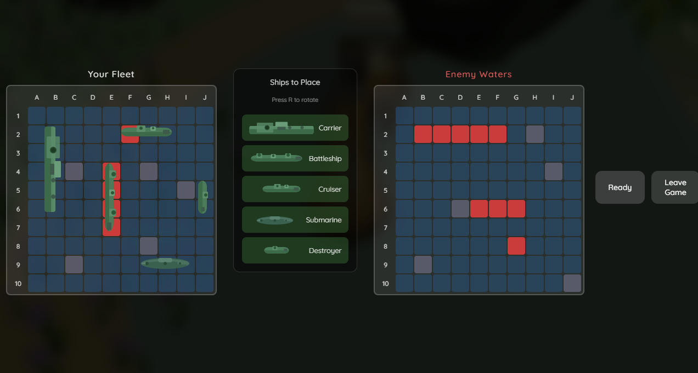
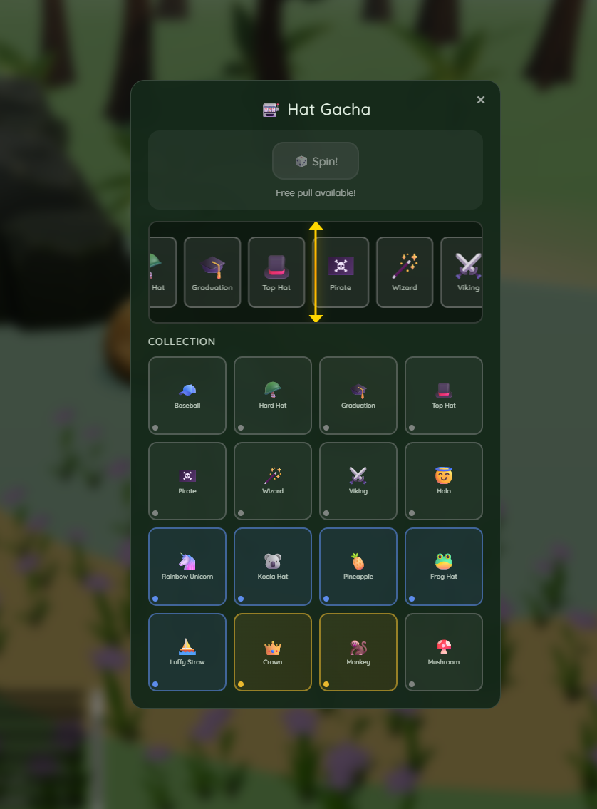
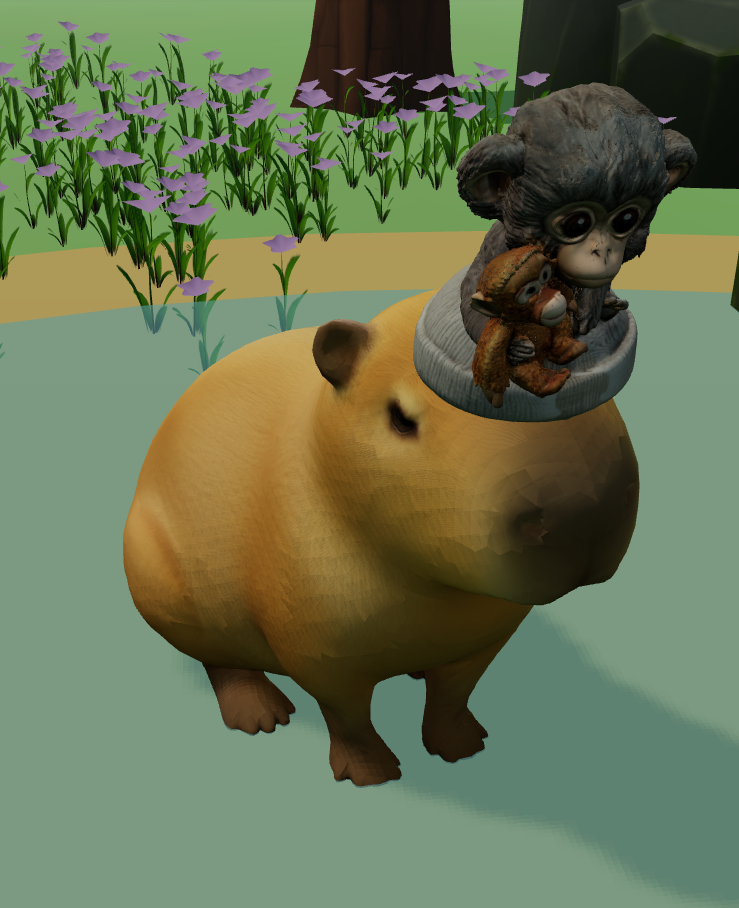

# Capybara Simulator

A serious and important contribution to the field of idle gaming.


---

## What Is This

You are presented with a capybara. The capybara sits. You may tap to change its hat. That is the full extent of your agency in this experience.

In return, you receive **Vibes**.

Vibes are points. Points imply progress. Progress implies purpose. We make no such claim.

## Screenshots

### Gameplay
<!-- TODO: Add screenshot of capybara moving around the world -->

*Move your capybara around the peaceful world*

### Multiplayer
<!-- TODO: Add screenshot showing multiple players -->

*Meet other capybaras in the Vibe World*

### Mini-Games
<!-- TODO: Add screenshot of Battleship or Caro game -->

*Challenge players to Battleship or Five in a Row*

### Gacha System
<!-- TODO: Add screenshot of gacha spinner -->

*Spin for rare and legendary hats*

---

## Features

### Core Gameplay
- **One (1) capybara**, rigged and animated
- **Movement** - WASD or Arrow keys to explore the world
- **Vibes** - Passively earn 1 vibe every 10 seconds
- **Lo-fi Music** - Ambient soundtrack with skip/mute controls
- **Rain Mode** - Toggle atmospheric rain with sound effects

### Hat Collection System

Collect 16 unique hats through the gacha system:

| Rarity | Drop Rate | Hats |
|--------|-----------|------|
| Common (60%) | Baseball, HardHat, Graduation, Top Hat, Pirate, Wizard, Viking, Halo, Mushroom |
| Rare (30%) | Rainbow Unicorn, Koala Hat, Pineapple, Frog Hat, Luffy Straw |
| Legendary (10%) | Crown, Monkey |



**How to get hats:**
1. Click the🎰 Gacha button in the top-right
2. Press "Spin" to roll for a random hat
3. Hats are saved to your collection automatically
4. Free pull available every 24 hours

**How to equip hats:**
1. Click the ⚙️ Customize button
2. Click any owned hat to equip it
3. Set your capybara's name while you're there

### Multiplayer Features

Connect to the **Vibe World** server automatically on load:

- **Player Count** - See how many capybaras are online
- **Real-time Chat** - Press Enter to send messages nearby players
- **Player Names** - Customize your name in the settings panel

### Social Interactions

When near another player, click them to:

- **Ride on back** - Mount another capybara and ride around
- **Challenge to Battleship** - Classic ship-sinking strategy game
- **Challenge to Five in a Row** - Gomoku-style board game (connect5 to win)

Press **SPACE** to dismount when riding.

---

## How to Play

### Getting Started
1. Open `index.html` in a modern browser
2. Wait for assets to load
3. Your capybara connects to multiplayer automatically

### Controls

| Key | Action |
|-----|--------|
| `W/AS/D` or `Arrow Keys` | Move capybara |
| `Mouse Drag` | Rotate camera |
| `Mouse Scroll` | Zoom in/out |
| `Click on Player` | Show interaction menu |
| `Enter` | Open chat input |
| `Space` | Dismount (when riding) |

### UI Buttons (Top Right)

| Button | Function |
|--------|----------|
| Skip (⏭️) | Skip to next music track |
| Mute (🔊) | Mute/Unmute all audio |
| Rain (☁️) | Toggle rain mode |
| Gacha (🎰) | Open gacha panel |
| Customize (⚙️) | Open customization panel |

---

## Technical Architecture

It's one HTML file. No build step required.

### Running Locally

```bash
# Simple serve
npx serve .

# Docker
docker build -t capybara .
docker run -p 3000:3000 capybara
```

### File Structure
```
├── index.html          # All game code (HTML/CSS/JS)
├── models/             # 3D models (.glb)
│   ├── hats/           # Hat models
│   ├── capybara-rigged.glb
│   └── ...
├── audio/              # Music and sound effects
└── README.md
```

---

## Contributing

The capybara does not require your assistance. However, if you insist:

1. Fork the repository
2. Make your changes
3. Ask yourself if the capybara would have wanted this
4. Submit a PR

---

## License

CC0 1.0 Universal — No rights reserved. The capybara belongs to everyone. The capybara belongs to no one. The capybara simply is.

---

## Acknowledgements

The capybara, for its patience.
